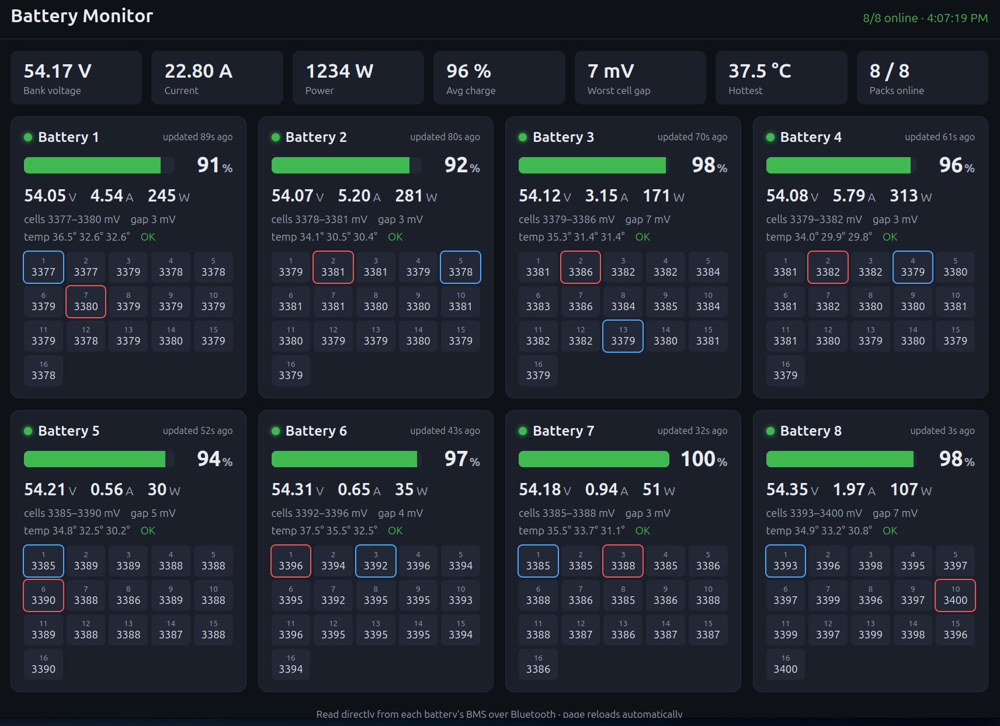

# Battery Monitor — see your battery cells on a screen

A simple way to watch your lithium (LiFePO₄) batteries on a **Raspberry Pi**. It
reads each battery over **Bluetooth** — voltage, current, charge level (SOC),
temperature, and **every individual cell** — and shows it all on a clean web page
you can open from your **phone, tablet, or computer**, or full-screen on a
**monitor plugged into the Pi**.

- ✅ No internet or cloud account needed — everything stays on your own network.
- ✅ No Solar Assistant, no Home Assistant, no MQTT — this runs on its own.
- ✅ **Read-only.** It only *reads* the batteries. It never changes any setting.
- ✅ Works with common **JBD / “Xiaoxiang” Bluetooth BMS** batteries (Vatrer,
  LiTime, Redodo, Overkill Solar, and many other 12V/24V/48V packs — if the
  battery’s own phone app talks to it over Bluetooth, this very likely works).

If you can copy and paste a few lines, you can set this up. Take it one part at a
time. ☕



---

## What you’ll need

- A **Raspberry Pi** (a Pi 3, 4, 5, or even a Pi Zero 2 W — anything with built-in
  Bluetooth) and its power supply.
- A **microSD card** (8 GB or bigger) and a way to plug it into your computer.
- Your **batteries with a Bluetooth BMS** (the kind you can see in the battery’s
  phone app), turned on and within a few meters of the Pi.
- Optional: a **monitor/TV + keyboard** for the Pi, if you want the picture shown
  right on the Pi itself. (You don’t need this to view it from your phone.)

---

## Part 1 — Put Raspberry Pi OS on the card

1. On your normal computer, download and install **Raspberry Pi Imager** from
   <https://www.raspberrypi.com/software/>.
2. Put the microSD card in your computer and open Imager.
3. Choose:
   - **Device:** your Pi model.
   - **Operating System:** *Raspberry Pi OS (64-bit)*. (The “with desktop”
     version is best if you’ll plug a monitor into the Pi. “Lite” is fine if
     you’ll only view it from your phone.)
   - **Storage:** your microSD card.
4. Click **Next**, then **Edit Settings** and set:
   - a **hostname** (e.g. `batteries` — remember it),
   - a **username and password** (write them down),
   - your **Wi-Fi name and password**,
   - turn on **Enable SSH** (under the Services tab).
5. Click **Save**, then **Write**. When it finishes, put the card in the Pi and
   power it on. Give it a couple of minutes the first time.

> 💡 “SSH” just means you can type commands to the Pi from your normal computer.
> On Windows use **PowerShell**; on Mac/Linux use **Terminal**.

---

## Part 2 — Connect to the Pi and get this program

From your normal computer, connect to the Pi (use the hostname and username you
chose — here we pretend they’re `batteries` and `pi`):

```bash
ssh pi@batteries.local
```

Type `yes` if asked, then your password. Now download this program onto the Pi:

```bash
sudo apt-get update && sudo apt-get install -y git
git clone https://github.com/Rotoslider/bms-display.git
cd bms-display
```

*(No GitHub account needed — that just copies the files onto the Pi.)*

---

## Part 3 — Run the one-step installer

```bash
bash setup.sh
```

This sets everything up for you: it installs what’s needed, makes the dashboard
start automatically whenever the Pi is on, and prints the **web address** at the
end. It may ask for your password along the way — that’s normal.

---

## Part 4 — Tell it which batteries are yours

First, let the Pi look for your batteries over Bluetooth:

```bash
venv/bin/python scan.py
```

It prints a list of nearby Bluetooth devices. Your batteries usually show up with
a **name that matches the serial number** printed on the battery label. Note down
the **address** (the `AA:BB:CC:DD:EE:FF` part) for each battery.

Now open the settings file and type them in:

```bash
nano config.json
```

Fill in the `batteries` list — one line per battery, with its address and any
name you like:

```json
"batteries": [
  { "mac": "A4:C1:37:11:22:33", "name": "Battery 1" },
  { "mac": "A4:C1:37:44:55:66", "name": "Battery 2" }
]
```

Save and exit nano: press **Ctrl+O**, then **Enter**, then **Ctrl+X**. Then
restart so it picks up your batteries:

```bash
sudo systemctl restart bms-display
```

> While you’re in `config.json`, you can also change the **title** at the top, the
> **port** (default 8080), or **poll_seconds** (how often it re-reads the
> batteries — 60 seconds is gentle and plenty).

---

## Part 5 — Look at your batteries 🎉

On **any phone, tablet, or computer on the same Wi-Fi**, open a web browser and go to:

```
http://batteries.local:8080
```

(Use your Pi’s hostname. If `.local` doesn’t work on your device, use the numbered
address the installer printed, like `http://192.168.1.50:8080`.)

You’ll see a card for each battery: charge level, voltage, current, temperature,
and every cell with the highest and lowest ones marked. The page updates itself —
just leave it open. **Cell gap** (the spread between the strongest and weakest
cell) is the number worth watching; small is healthy.

---

## Optional — show it on a screen attached to the Pi

If you put *Raspberry Pi OS with desktop* on the card and have a monitor plugged
into the Pi, you can make it open the dashboard full-screen all by itself:

```bash
bash kiosk/setup-kiosk.sh
sudo reboot
```

After it restarts, the screen shows your batteries automatically. (To leave the
full-screen view, plug in a keyboard and press **Alt+F4**.)

---

## Everyday use

Once it’s set up, you don’t have to do anything — it starts on its own every time
the Pi powers up. Handy commands if you ever need them:

```bash
systemctl status bms-display      # is it running?
sudo systemctl restart bms-display # restart it
journalctl -u bms-display -f       # watch what it's doing (Ctrl+C to stop watching)
```

---

## If something isn’t right

- **The web page won’t open.** Make sure your phone is on the **same Wi-Fi** as
  the Pi. Try the numbered address (e.g. `http://192.168.1.50:8080`) instead of
  the `.local` name. Find the Pi’s number with `hostname -I` on the Pi.
- **A battery shows “offline”.** It may be too far from the Pi, asleep, or another
  device (like the battery’s phone app) is connected to it — close that app. One
  battery occasionally dropping out is normal with lots of packs on one Bluetooth
  radio; it retries on its own. Moving the Pi closer helps.
- **`scan.py` finds nothing.** Make sure the batteries are **on and awake** (some
  sleep when idle — turn on a load or charger for a moment). Check Bluetooth is
  running: `systemctl status bluetooth`.
- **It says Bluetooth permission denied.** Log out and back in once after the
  first install (the installer adds you to the Bluetooth group), or just
  `sudo reboot`.

---

## Is this safe for my batteries?

Yes. This program **only reads** information from the battery’s BMS over
Bluetooth — exactly like the battery’s own phone app does. It **never** sends any
command or changes any setting on your batteries. You can’t hurt anything by
looking.

---

## For tinkerers

- `app.py` — the web server + the background Bluetooth reader.
- `bms_reader.py` — the battery-reading code (JBD/Xiaoxiang BLE protocol).
- `scan.py` — lists nearby Bluetooth devices.
- `config.json` — your settings (made from `config.example.json`).
- `templates/` + `static/` — the web page and its styling.
- `systemd/bms-display.service` — the auto-start service (installed for you).
- `kiosk/` — the optional full-screen-on-the-Pi setup.

The data is also available as raw JSON at `http://<pi>:8080/api/data` if you want
to build your own display or log it.

Built with [bleak](https://github.com/hbldh/bleak) (Bluetooth), [Flask](https://flask.palletsprojects.com/)
and [waitress](https://github.com/Pylons/waitress). Released into the **public
domain** (The Unlicense) — use it however you like, no restrictions; see `LICENSE`.
This is the standalone cousin of the
[bms-mqtt-ha](https://github.com/Rotoslider/bms-mqtt-ha) project (which adds Home
Assistant and closed-loop inverter control).
